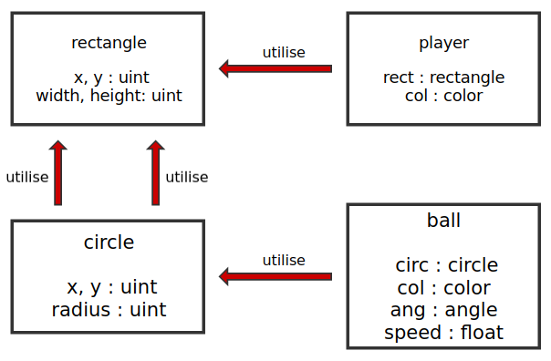

# DO178

## Développement d'un jeu Pong sur STM32F4 discovery

### Robin Rebischung <rebisc_r@epita.fr>
### Francis Visoiu Mistrih <visoiu_f@epita.fr>

# Requirements

## System requirements

**SR**: `Pong` est un jeu développé sur une board `STM32F4 discovery`. Le but du
jeu est de simuler un jeu de `ping-pong`, donc avec deux raquettes et une balle,
afin de gagner la partie. Le jeu consiste en plusieurs échanges, et lorsque la
balle sort du camps d'un joueur, le joueur perd.

## High-level requirements

**HLR.1:** La balle se déplace de raquette en raquete, avec une vitesse et un
angle.

      LLR 1.1: La fonction `game_ball.draw` permet d'afficher la balle à
               l'écran.

      LLR 1.2: La fonction `game_ball.update` met à jour la position de la balle
               en fonction de la position courante, la vitesse, l'angle, et les
               limites de l'écran.

**HLR.2:** Au démarrage, la balle est au centre, et avance vers le joueur vert.
Le joueur vert est l'utilisateur, et le joueur rouge est l'ennemi.

      LLR 2.1: L'initialisation du type record `ball` se fait avec une vitesse
               de `10.0` et un angle de `90`. Ainsi, la position est à
               `width'last / 2`, `height'last / 2`. La taille de la balle a un
               rayon de 10.

      LLR 2.2: L'ennemi est initialisé de la même manière, et contient une
               couleur rouge, et vert pour l'utilisateur.

**HLR.3:** Lorsque la balle touche une raquette, la balle part dans la
direction opposée, sur les deux axes, x et y.

      LLR 3.1: La fonction `core_geometry.intersects` permet de trouver si un
               cercle et un rectangle contiennent une zone commune.

      LLR 3.2: Lorsque y'a intersection, l'angle de la balle part à `+45` ou
               `-45` en fonction de l'angle initial (cos(angle) > 0.0).

**HLR.4:** Afin de bouger la raquette de l'utilisateur, il faut appuyer sur la
partie gauche de l'écran pour aller à gauche, puis la partie droite de l'écran
pour aller à droite.

```
--------------
|    -----    |
|      |      |
|      |      |
|      |      |
|      |      |
|  G   *   D  |
|      |      |
|      |      |
|      |      |
|      |      |
|    -----    |
---------------
```

      LLR 4.1: Lorsque l'appui est détécté, un déplacement sur l'axe des `x` est
                éffectué sur la raquette de l'utilisateur. Le déplacement est
                fait de `10` pixels.

**HLR.5:** L'utilisateur ne peut pas placer directement la raquette où il
souhaite, mais doit utiliser les zones de mouvement afin de bouger la raquette.

      LLR 5.1: L'appui sur l'écran permet de déplacer progressivement la
               raquette, et ne permet pas de choisir une position arbitraire.

**HLR.6:** A chaque tour, la vitesse de la balle augmente.

      LLR 6.1: La fonction `game_ball.update` met à jour la vitesse de la
               balle.



\pagebreak

## Core

### Core Geometry

* uint

* rectangle

    * "="
    * draw

* circle

    * "="
    * draw

### Core Math

* pow2

* cos

* sin

### Core Utils

* sleep

* rand

## Game

### Game Ball

* "="

* move

* slide_x

* slide_y

* draw

* update

### Game Player

* "="

* move

* slide_x

* draw

* update_enemy
